# AI Agent Optimized - 方法流程与分析

## 文件结构概览

```
ai_agent_optimized.py
├── 全局配置
│   ├── _session (HTTP Session with retry)
│   ├── _search_cache / _bundle_cache (全局缓存)
│   └── _optimized_agent (全局Agent实例)
│
├── 类定义
│   ├── SimpleCache (缓存类)
│   ├── WorkflowLog (工作流日志)
│   ├── Tool (工具基类)
│   ├── SearchTool (搜索工具)
│   ├── FilterTool (过滤工具)
│   ├── RecommendTool (推荐工具)
│   ├── BundleSearchTool (套装搜索工具)
│   └── OptimizedAIAgent (主AI Agent)
│
└── 函数
    └── get_optimized_ai_agent() (获取Agent实例)
```

---

## 1. SimpleCache 类

### 作用
带TTL（生存时间）的简单内存缓存，用于缓存搜索结果和套装搜索结果。

### 方法流程

#### `__init__(ttl_seconds: int = 300)`
```
初始化缓存
├── 创建空字典 _cache: Dict[str, tuple[Any, datetime]]
└── 设置TTL时间
```

#### `_make_key(*args, **kwargs) -> str`
```
生成缓存键
├── 将args和kwargs序列化为JSON
├── 按key排序确保一致性
└── MD5哈希生成固定长度键
```

#### `get(*args, **kwargs) -> Optional[Any]`
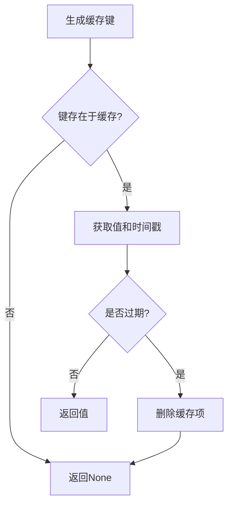

#### `set(value: Any, *args, **kwargs)`
```
设置缓存值
├── 生成缓存键
└── 存储 (值, 当前时间) 元组
```

#### `clear()`
```
清空所有缓存
```

---

## 2. WorkflowLog 类

### 作用
表示单个工作流日志条目，用于追踪AI处理流程。

### 方法流程

#### `__init__(step, type, message, detail, status, metadata)`
```
初始化日志
├── 生成唯一ID: f"{timestamp}-{step}"
├── 保存步骤类型、消息、详情
├── 设置状态 (默认"active")
├── 保存元数据
└── 记录时间戳
```

#### `to_dict() -> Dict`
```
转换为字典格式
└── 返回包含所有字段的字典，timestamp转为ISO格式
```

---

## 3. Tool 基类

### 作用
所有工具的基类，定义工具的通用接口。

### 方法流程

#### `__init__(name, description, parameters)`
```
初始化工具
├── 工具名称
├── 工具描述
└── 参数定义 (JSON Schema格式)
```

#### `to_dict() -> Dict`
```
转换为OpenAI工具格式
└── 返回 {type: "function", function: {...}} 结构
```

---

## 4. SearchTool 类 (继承Tool)

### 作用
搜索家具产品，带缓存功能。

### 方法流程

#### `__init__()`
```
初始化
├── 调用父类初始化
│   ├── name: "search_products"
│   ├── description: 搜索家具产品
│   └── parameters: {query, category}
└── 初始化 FurnitureDatabase()
```

#### `execute(query, category) -> Dict`
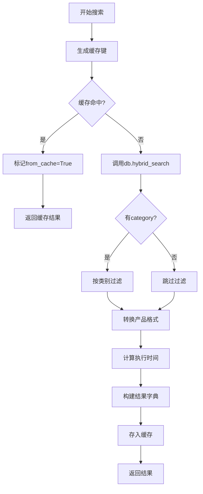

**输出格式：**
```python
{
    "success": True,
    "count": int,
    "products": [...],  # 产品列表
    "metadata": {
        "query": str,
        "category": str,
        "execution_time_ms": float,
        "search_method": "semantic" | "fallback",
        "from_cache": bool
    }
}
```

---

## 5. FilterTool 类 (继承Tool)

### 作用
按价格范围过滤产品。

### 方法流程

#### `__init__()`
```
初始化
├── name: "filter_by_price"
├── description: 按价格过滤
└── parameters: {min_price, max_price}
```

#### `execute(products, min_price, max_price) -> Dict`
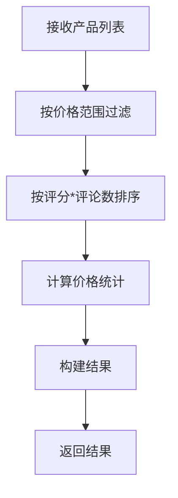

---

## 6. RecommendTool 类 (继承Tool)

### 作用
基于风格、房间、预算获取个性化推荐。

### 方法流程

#### `__init__()`
```
初始化
├── 调用父类初始化
└── 创建SearchTool实例
```

#### `execute(style, room, budget) -> Dict`
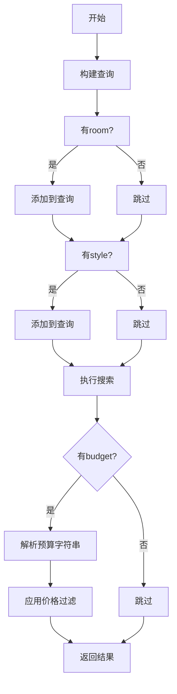

**预算解析规则：**
- "under $500" → max_price=500
- "around $1000" → price in [700, 1300]
- "over $2000" → min_price=2000

---

## 7. BundleSearchTool 类 (继承Tool)

### 作用
搜索多个相关产品作为套装。

### 方法流程

#### `__init__()`
```
初始化
├── name: "search_bundle"
├── description: 搜索套装
├── parameters: {items[], room, style, budget}
└── 创建SearchTool实例
```

#### `execute(items, room, style, budget) -> Dict`
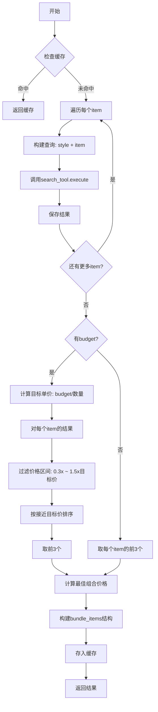

**输出格式：**
```python
{
    "success": True,
    "bundle_items": [
        {"item_type": "desk", "products": [...], "count": 3},
        {"item_type": "chair", "products": [...], "count": 3}
    ],
    "total_products": int,
    "metadata": {
        "items": [...],
        "room": str,
        "style": str,
        "budget": float,
        "suggested_combo_price": float
    }
}
```

---

## 8. OptimizedAIAgent 类 (核心类)

### 作用
主AI Agent，处理用户消息，协调工具调用。

### 属性
```python
self.tools = {
    "search_products": SearchTool(),
    "filter_by_price": FilterTool(),
    "get_recommendations": RecommendTool(),
    "search_bundle": BundleSearchTool()
}
self.conversation_history  # 对话历史
self.current_products      # 当前产品列表
self.workflow_logs         # 工作流日志
self._observers            # 观察者列表
self.current_bundle        # 当前套装
self.redis_store           # Redis存储
```

### 方法流程

#### `__init__(user_id)`
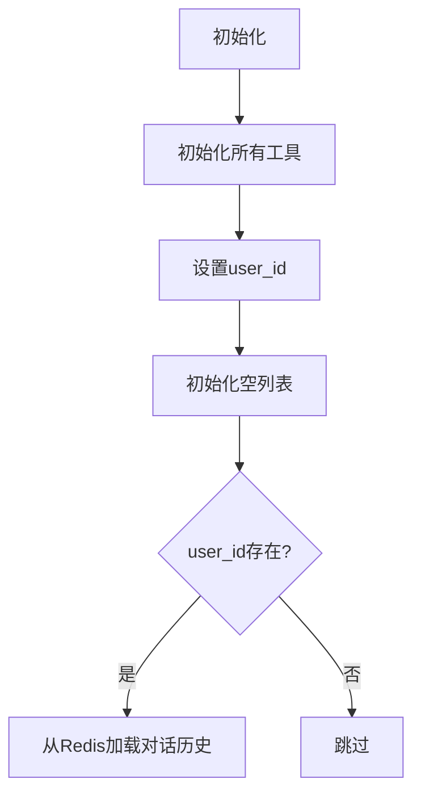

#### `_load_conversation_history()`
```
从Redis加载历史
├── 检查user_id
├── 调用redis_store.get_messages(limit=50)
├── 设置到conversation_history
└── 异常时设置为空列表
```

#### `_save_message_to_redis(role, content)`
```
保存消息到Redis
├── 验证user_id有效
├── 构建消息字典(含时间戳)
├── 调用redis_store.save_message()
└── 打印日志
```

#### `set_user_id(user_id)`
```
设置用户ID
├── 更新user_id
└── 重新加载对话历史
```

#### `clear_conversation_history()`
```
清空对话历史
├── 清空内存中的历史
└── 清空Redis中的历史
```

#### `add_observer(callback)` / `_notify_observers(log)`
```
观察者模式
├── 添加回调函数到列表
└── 通知时遍历调用所有回调
```

#### `_add_log(step, type, message, detail, metadata)`
```
添加工作流日志
├── 创建WorkflowLog对象
├── 添加到workflow_logs列表
├── 通知所有观察者
└── 返回log对象
```

#### `get_tool_definitions() -> List[Dict]`
```
获取工具定义
└── 遍历self.tools，调用每个tool.to_dict()
```

#### `_get_system_prompt(current_products_count) -> str`
```
生成系统提示词
├── 基础角色定义
├── 关键规则 (CRITICAL RULES)
├── 可用工具列表
├── 工具选择规则
├── 套装预算规则
└── 当前产品数量
```

#### `_execute_tools_parallel(tool_calls) -> List[Dict]`
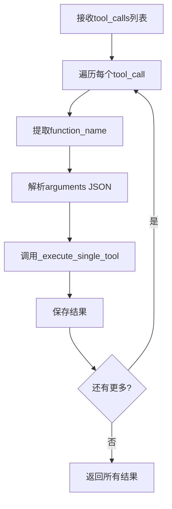

#### `_execute_single_tool(tool_name, arguments) -> Dict`
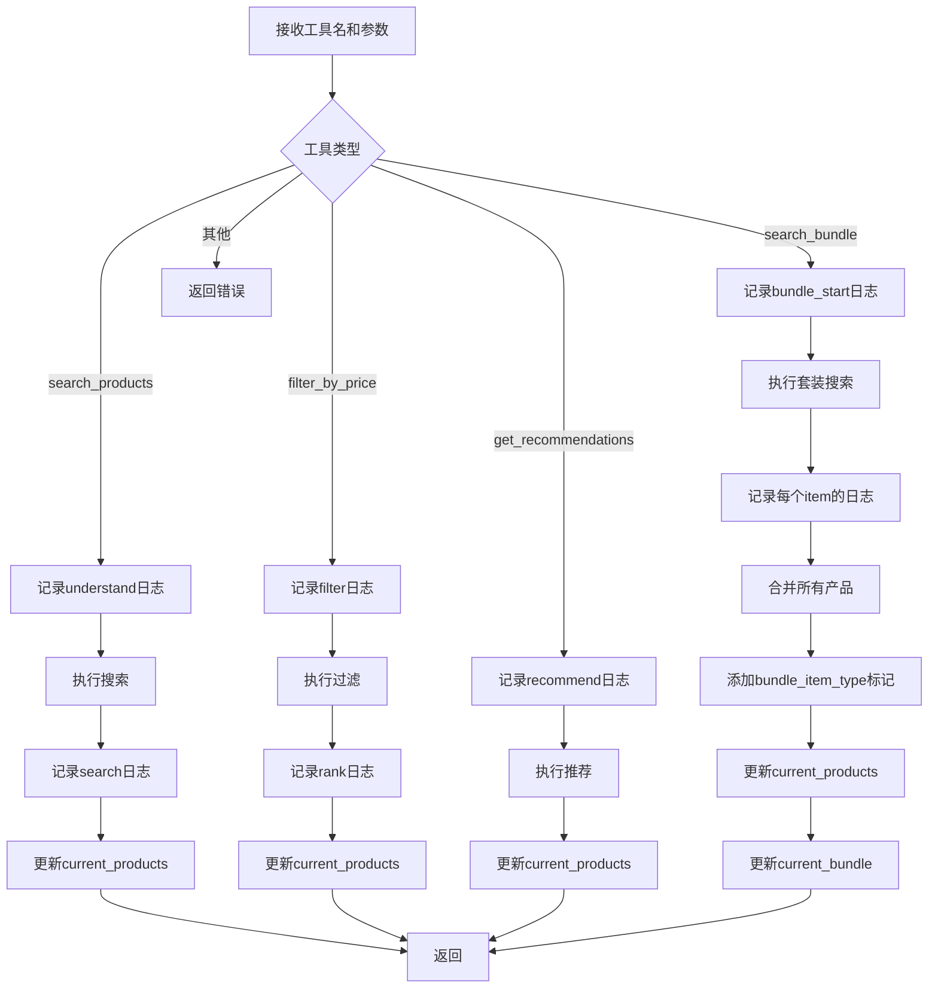

#### `_calculate_match_accuracy(query, products) -> float`
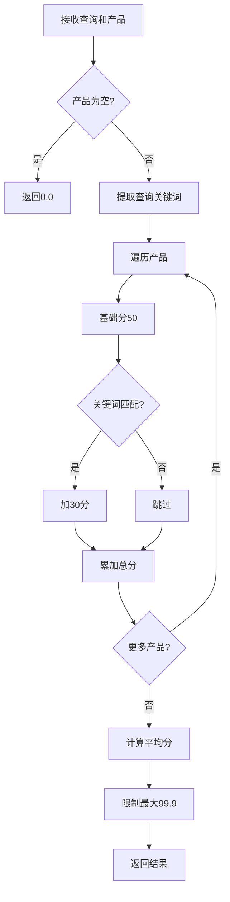

#### `async process_message(message) -> Dict` (核心方法)

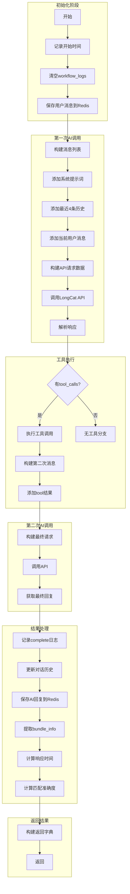

**详细步骤说明：**

```
1. 初始化阶段
   ├── 记录开始时间
   ├── 清空工作流日志
   └── 保存用户消息到Redis

2. 构建消息
   ├── System Prompt (动态生成，含当前产品数量)
   ├── Last 4 messages from conversation_history
   └── Current user message

3. 第一次API调用 (带tools)
   ├── Model: LongCat-Flash-Chat
   ├── tools: 4个工具定义
   ├── tool_choice: "auto"
   ├── temperature: 0.3
   └── max_tokens: 1500

4. 处理AI决策
   ├── Case 1: AI调用工具
   │   ├── 解析tool_calls
   │   ├── 执行工具 (并行)
   │   ├── 构建第二次消息 (含tool结果)
   │   └── 第二次API调用获取最终回复
   │
   └── Case 2: AI直接回复
       └── 无需搜索，直接返回回复

5. 结果处理
   ├── 记录完成日志
   ├── 更新对话历史 (保留最近8条)
   ├── 保存AI回复到Redis
   ├── 提取bundle_info (如果有)
   ├── 计算响应时间
   └── 计算匹配准确度

6. 返回格式
   {
       "reply": str,                    # AI回复文本
       "products": List[Dict],          # 产品列表(最多20个)
       "result_count": int,             # 产品总数
       "tools_used": List[str],         # 使用的工具
       "workflow_logs": List[Dict],     # 工作流日志
       "bundle_info": Optional[List],   # 套装信息
       "response_time": float,          # 响应时间(秒)
       "match_accuracy": float          # 匹配准确度(0-100)
   }

7. 错误处理
   ├── HTTP 429: 速率限制
   ├── HTTP Error: API错误
   └── Exception: 一般错误
```

---

## 9. 全局函数

#### `get_optimized_ai_agent() -> OptimizedAIAgent`
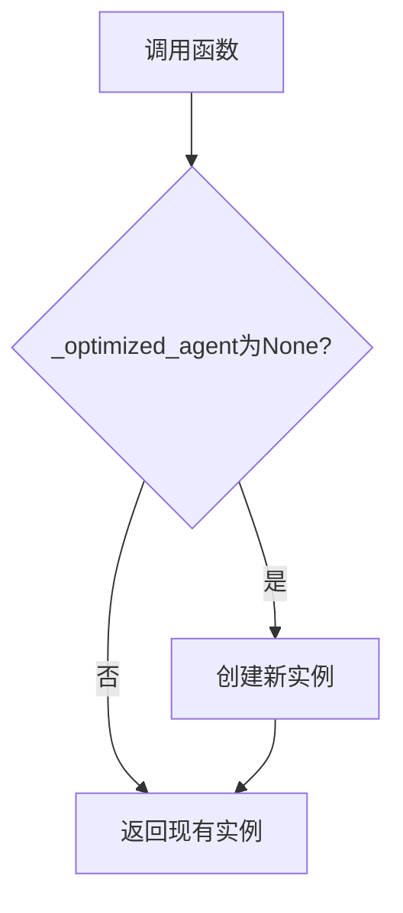

**单例模式**：确保整个应用只有一个Agent实例。

---

## 完整请求处理流程图

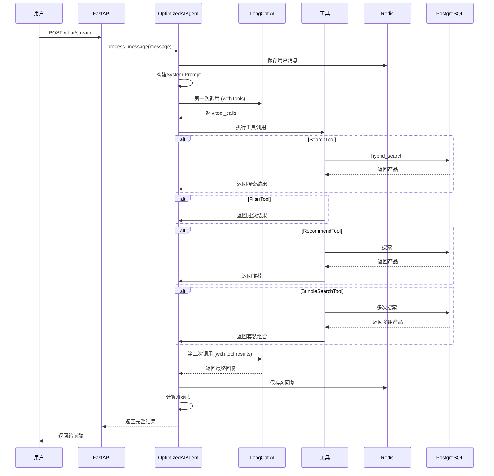

---

## 性能优化点

1. **缓存机制**
   - 搜索结果缓存 (5分钟TTL)
   - 套装搜索缓存 (5分钟TTL)

2. **连接池**
   - HTTP Session复用
   - 连接池大小: 20

3. **历史裁剪**
   - 只保留最近4条历史用于AI调用
   - 内存中保留最近8条

4. **超时设置**
   - API调用超时: 30秒
   - 重试次数: 2次

5. **Token限制**
   - 第一次调用: max_tokens=1500
   - 第二次调用: max_tokens=1000

---

## 错误处理策略

| 错误类型 | 处理方式 |
|---------|---------|
| 429 Rate Limit | 返回中文提示"请求过于频繁" |
| HTTP Error | 返回"API Error" |
| 通用 Exception | 返回"Error" |
| Redis连接失败 | 打印错误，继续运行 |
| 缓存失效 | 回退到数据库查询 |
